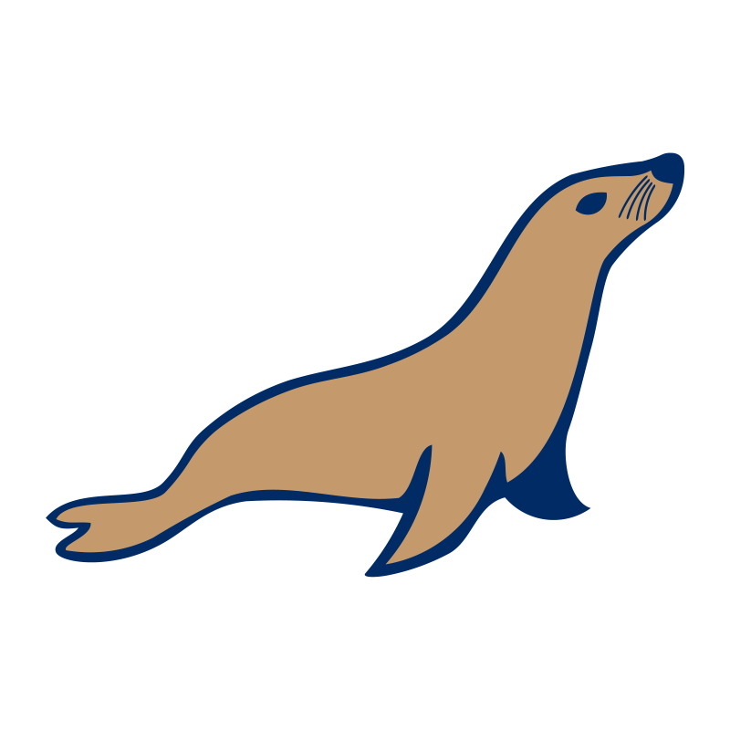

 
 

# I'm passionate about development. 👨🏻‍💻

## Programming languages

  
  
  
  
  
  
  

## Tools

  
  
  

## Databases

  
  
  

## Libs & Frameworks

  
  
  
  

 

- My portfolio: https://tamdaz.fr
- My LinkedIn: https://fr.linkedin.com/in/zohir-tamda

<!--
**tamdaz/tamdaz** is a ✨ _special_ ✨ repository because its `README.md` (this file) appears on your GitHub profile.

Here are some ideas to get you started:

- 🔭 I’m currently working on ...
- 🌱 I’m currently learning ...
- 👯 I’m looking to collaborate on ...
- 🤔 I’m looking for help with ...
- 💬 Ask me about ...
- 📫 How to reach me: ...
- 😄 Pronouns: ...
- ⚡ Fun fact: ...
-->

[def]: mg/skills/laravel-logo.sv